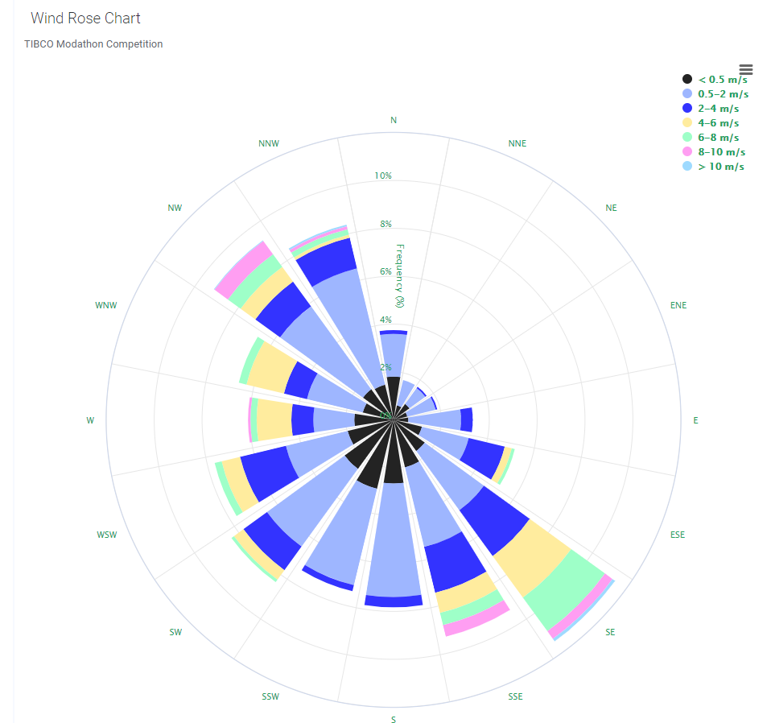

# Mod Modathon Wind Rose Project

The intent behind the Mod served the purpose of the TIBCO Modathon during Apr, 22nd/2021 - May, 20th/2021.
Disclaimer: The use of Highcharts does not obey any business objectives, Highcharts was used as a random choice and ease of use for the creation of this Mod. 

All source code for the mod example can be found in the `src` folder.

## Prerequisites
These instructions assume that you have [Node.js](https://nodejs.org/en/) (which includes npm) installed.
This demo was constructed using a non-profit development license of highcharts for details see (https://highcharts.com).

## How to get started (with development server)
- Open a terminal at the location of this example.
- Run `npm install`. This will install necessary tools. Run this command only the first time you are building the mod and skip this step for any subsequent builds.
- Run 'npm install highcharts --save'.  Failure to have highcharts installed may generate errors when trying to use the Mod. 
- Run `npm run server`. This will start a development server.
- Start editing, for example `src/main.js`.
- In Spotfire, follow the steps of creating a new mod and connecting to the development server.

## Working without a development server
- In Spotfire, follow the steps of creating a new mod and then browse for, and point to, the _manifest_ in the `src` folder.
